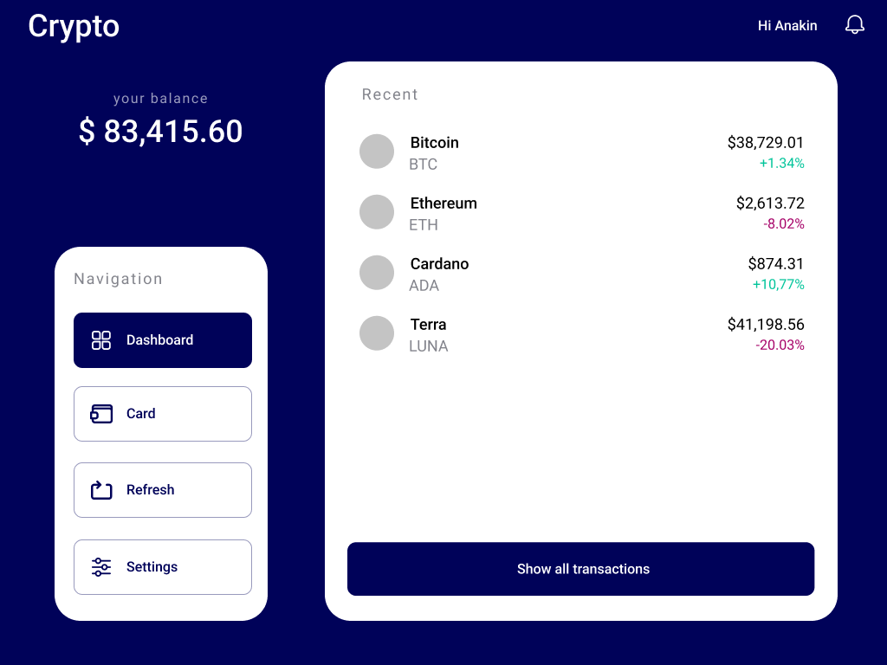

This is a very simple stock/crypto app developed for the Kelisto FE Challenge.

## How to check the project
Three different ways have been provided to evaluate this project:
- Deployed application (recommended)
- Development server
- Build and run

### Deployed application (recommended)
The last version of this app is always deployed [here](https://kelisto-jl-acosta.netlify.app) thanks to a [GitHub Action](https://help.github.com/en/actions/getting-started-with-github-actions/about-github-actions) automated CI workflow. This is the easiest way to check the project.
### Development server
Check out the repository and run `npm install` to install all dependencies. After that run `npm start` to start a dev server. Navigate to `http://localhost:3000/` in your browser.
### Build and run
Check out the repository and run `npm run build` to build the project. The build artifacts will be stored in the `build` directory. Go there and launch `index.html`.


## Folder structure
```bash
kelisto-frontend-js-challenge-crypto
├───.github
│   └───workflows
├───data
├───docs
├───public
└───src
    ├───api
    ├───assets
    │   ├───resources
    │   └───themes
    ├───components
    │   ├───AppWrapper
    │   ├───Button
    │   ├───DetailsPanel
    │   ├───Icon
    │   ├───NavBar
    │   ├───PageWrapper
    │   ├───StockList
    │   │   └───components
    │   └───TopBar
    ├───pages
    │   ├───Dashboard
    │   │   └───components
    │   └───UnderConstruction
    ├───routes
    ├───tests
    │   ├───components
    │   ├───helpers
    │   ├───pages
    │   └───utils
    ├───types
    └───utils

```
The following folders have been added to the provided repository:
### .github/workflows
CI/CD assets.
### public
Contains the web application public assets.
### src
The `src` folder has been structured to make it easy to understand the contents and their role in the application. It contains the following folders:
#### api
The functionality to communicate with the required APIs.
#### assets
The required resources for the app.
#### components
Reusable components for the whole app.
#### pages
The main views of the app.
#### routes
The browser routes.
#### tests
Test cases. It mimics the structure of the `src` folder.
#### types
TypeScript types and interfaces.
#### utils
Utility scripts and functions.

## Framework/library
This project has been developed in [React](https://es.reactjs.org/) for the following reasons:
- It was suggested from the challenge creators
- I have a great deal of experience with it

## Styling
The chosen method for applying styles to the app is [styled-components](https://styled-components.com/) for a few reasons:
- Component centric
- Easy maintenance
- Easy component extraction
- Easy to theme
- Easy layouting in tandem with `flexbox`

## Testing
[](https://github.com/Jodebu/kelisto-frontend-js-challenge-crypto/actions/workflows/main.yaml)

Due to time restrictions, only a handful have been implemented.

## Remarks
Some remarks I would like to state regarding this challenge:

### State management
Even though no state management is really required for this app, I included a very simple example of what it should look like in the [Dashboard](./src/pages/Dashboard/Dashboard.tsx) component
### Color token mishaps
One of the color tokens provided ( `#C4C4C4`) is slightly darker in the mocks ( `#82838B`). I have used the one in the color tokens since it is the properly documented one.
### Crypto logo
A very simple function has been written to retrieve the logo of a currency from its SKU. This function relies on the [Crypto Icon API](https://cryptoicon-api.vercel.app).
### Under construction pages
Since one of the requisites is to have the app production ready, some navigation elements will land on a page labeled "Under construction" to avoid broken links.

## Next steps
These are some improvements I would like to add given the time:

### Complete test suites
Obviously, the first thing to do would be to finish all tests.
### Desktop version
The app component structure is extremely modular, so this step should not be very difficult or time-consuming. Here is a fast mock of the considered implementation:

### Alternative themes
Very easy with the styled-components [ThemeProvider](https://styled-components.com/docs/api#themeprovider).
### Skeleton components
With a little more time, I would have also liked to include loading skeletons with the help of [react-loading-skeleton](https://github.com/dvtng/react-loading-skeleton#readme).
### Internationalization
Not difficult but a little time-consuming. I would go with [react-intl](https://formatjs.io/docs/react-intl/).
