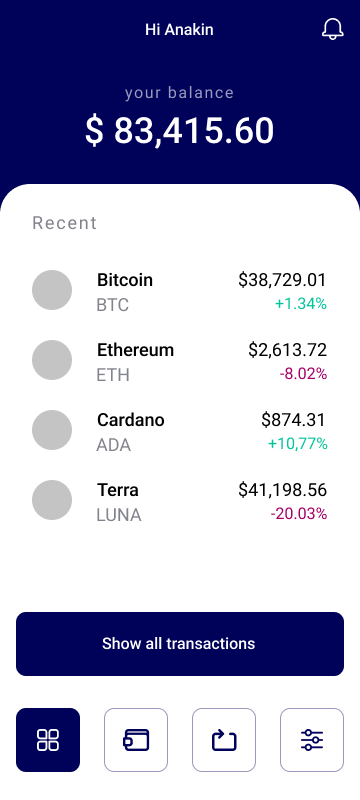

<h1 align="center">Frontend JS Challenge – Crypto</h1>
<div align="center">
  <a style="margin-right: 8px;" href="https://github.com/kelkoo-services/kelisto-frontend-js-challenge-crypto/pulls">
    
  </a>
</div>

<!-- START doctoc generated TOC please keep comment here to allow auto update -->
<!-- DON'T EDIT THIS SECTION, INSTEAD RE-RUN doctoc TO UPDATE -->

- [✨ Introduction](#-introduction)
- [✏️ Exercise](#-exercise)
- [Wireframe](#wireframe)
- [Resources](#resources)
- [Product API](#product-api)
- [🔨 Tools, libraries and frameworks](#-tools-libraries-and-frameworks)
- [💯 Assessment](#-assessment)
- [🚀 Project submitting](#-project-submitting)
- [🤘 What’s next?](#-whats-next)

<!-- END doctoc generated TOC please keep comment here to allow auto update -->

## ✨ Introduction

Welcome to the coding challenge for developers interested in **Frontend Engineer** roles in Kelisto. It's not an against-the-clock time challenge - you can complete it at home in your own time.

Ideally, you will return your submission **within 3 days** - the sooner you get your submission back to us, the more quickly we can progress your application to the interview stage.

## ✏️ Exercise

In this exercise, you will develop a crypto dashboard page. Your solution should:

- Be a website, using React or similar (we prefer the use of React because we use it in our prod environments, but feel free to use any other framework/library if you feel more comfortable – you can try to surprise us ❤️).
- Consume a JSON feed of stocks (see below) and display them on a page.
- Allow users to see a list of stocks in the dashboard view.
- Allow users to see the total stock at the top of the dashboard view (calculated by sum of all crypto stocks).

## Wireframe

<p align="left">
  <a href="./docs/wireframe-mobile.png"></a>
</p>

## Resources

- [UI Prototype – Dashboard view (Figma)](https://www.figma.com/file/2OsAfZKX97PYus4AhwbbWO/Frontend-Challenge-%E2%80%93%C2%A0Crypto?node-id=0%3A1)
- [UI Prototype - Dashboard view (PNG)](./docs/wireframe-mobile.png)
- [UI Design Tokens (PNG)](./docs/design-tokens.png)
- Font: [Roboto](https://fonts.google.com/specimen/Roboto?sidebar.open=true&selection.family=Roboto:wght@400;500)

```html
/* Font usage */
<link rel="preconnect" href="https://fonts.googleapis.com" />
<link rel="preconnect" href="https://fonts.gstatic.com" crossorigin />
<link
  href="https://fonts.googleapis.com/css2?family=Roboto:wght@400;500&display=swap"
  rel="stylesheet"
/>
```

- Font Icon: [Kelisto Frontend Challenge Icons](https://d1azc1qln24ryf.cloudfront.net/174874/FrontendChallenge/style-cf.css?fhefj0).

```html
/* Font Icon usage */
<link
  rel="stylesheet"
  href="https://d1azc1qln24ryf.cloudfront.net/174874/FrontendChallenge/style-cf.css?fhefj0"
/>

<i class="k-icon-bell"></i>
```

## Stocks API

Please fetch the stocks to be displayed as JSON from this URL: [./data/response.json](./data/response.json).

## 🔨 Tools, libraries and frameworks

Please build your solution as a website and focused on mobile first design principles. We consider positively if the application supports other resolutions.

Other than React or similar, the choice of libraries, frameworks or tools used to develop the application is left open to you. We encourage you to use options you're familiar with, and that you'd feel comfortable explaining the choices you make with them.

Your application will be reviewed on an up-to-date version of Chrome, but you're free to include compatibility for other browsers to enhance your application.

As part of the interview process, our engineers will review your code as well as your application. Please ensure the code you write can be shared with our team, for example through a GitHub or Bitbucket repository, or as a compressed folder.

## 💯 Assessment

We will assess your application based on the following criteria:

- How clean, modular and extensible the code is.
- Testing.
- Suitability of tools, libraries and frameworks used (for both the app itself and any build processes involved).
- How it looks visually and the techniques used to style the application.
- Plus. Responsive web design techniques used and the approach used for layout.
- Plus. Anything above and beyond e.g. accessibility, scalability, animation, routing, dockerized, etc.

## 🚀 Project submitting

To send us your code, you can:

- Make a fork of this repository, and send us a pull request;
- or give access to your repository in Github/Bitbucket.

## 🤘 What’s next?

We appreciate your time is important. Once you submit your solution, our team will review your code challenge, taking your experience level into account. The sample code provided by you should be in a state considered as "production" ready. Therefore, if you feel your unfinished code demonstrates enough for us to assess the application please leave some notes in your `ABOUT.md` explaining what you would do next given more time.

Good luck!

**“The Challenge” has been created with the sole intention of being used as a guiding document for the current recruitment process. This means we won't be using it (all or parts of it) within our projects.**
